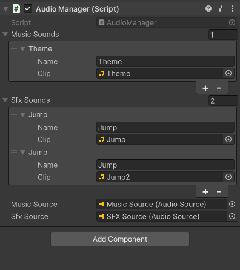

## Audio manager unity

The Unity AudioManager is a versatile tool for managing audio in Unity projects, offering functionalities like sound playback, volume control, and spatial audio effects. It simplifies the integration of sound into games and applications, enhancing the immersive experience for users.



<br>


```c#

using UnityEngine;
using System;

public class AudioManager : MonoBehaviour
{
    public static AudioManager Instance;

    [Serializable]
    public class Sound
    {
        public string name;
        public AudioClip clip;
    }

    public Sound[] musicSounds, sfxSounds, navigationSounds, droneSounds, miscSounds;
    public AudioSource musicSource, sfxSource, navigationSFXSource, droneSFXSource, miscSource;

    private void Awake()
    {
        if (Instance == null)
        {
            Instance = this;
            DontDestroyOnLoad(gameObject);
        }
        else
        {
            Destroy(gameObject);
        }
    }

    private void Start()
    {
        PlayMusic("Theme");
    }

    public void PlayMusic(string name)
    {
        Sound s = Array.Find(musicSounds, x => x.name == name);
        if (s == null)
        {
            Debug.Log("Music Not Found");
        }
        else if (musicSource != null)
        {
            musicSource.clip = s.clip;
            musicSource.Play();
        }
    }

    public void PlaySFX(string name)
    {
        Sound sfxSound = Array.Find(sfxSounds, x => x.name == name);
        if (sfxSound == null)
        {
            Debug.Log("Sound Not Found");
            return;
        }

        if (sfxSource != null)
        {
            sfxSource.PlayOneShot(sfxSound.clip);
        }
    }

    public void PlayNavigationSFX(string name)
    {
        Sound navSound = Array.Find(navigationSounds, x => x.name == name);
        if (navSound == null)
        {
            Debug.Log("Navigation Sound Not Found");
            return;
        }

        if (navigationSFXSource != null)
        {
            navigationSFXSource.PlayOneShot(navSound.clip);
        }
    }

    public void PlayDroneSFX(string name)
    {
        Sound droneSound = Array.Find(droneSounds, x => x.name == name);
        if (droneSound == null)
        {
            Debug.Log("Drone Sound Not Found");
            return;
        }

        if (droneSFXSource != null)
        {
            droneSFXSource.PlayOneShot(droneSound.clip);
        }
    }

    public void PlayMisc(string name)
    {
        Sound miscSound = Array.Find(miscSounds, x => x.name == name);
        if (miscSound == null)
        {
            Debug.Log("Misc Sound Not Found");
            return;
        }

        if (miscSource != null)
        {
            miscSource.PlayOneShot(miscSound.clip);
        }
    }

    // Method to stop a sound effect
    public void StopSFX()
    {
        if (sfxSource != null && sfxSource.isPlaying)
        {
            sfxSource.Stop();
        }
    }
}


