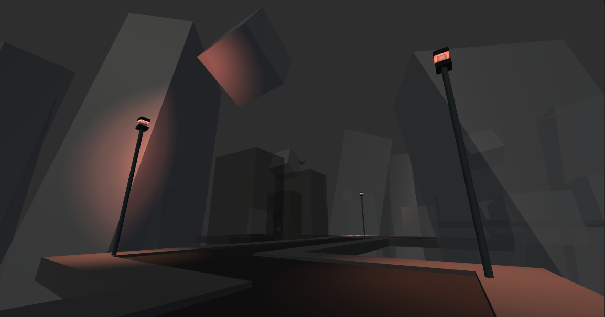
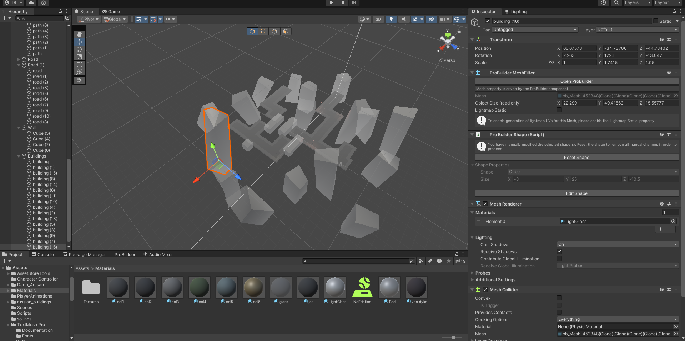

## Camera/Robot Navigation

The Unity NavMeshAgent is a component used for pathfinding and navigation in Unity projects, allowing game objects to navigate dynamically generated navigation meshes. NavMeshSurfaces are used to define areas where navigation can occur by generating navigation meshes based on the geometry of the scene, facilitating smooth movement for AI-controlled characters or objects.

<iframe width="1280" height="636" src="https://www.youtube.com/embed/rGPEn0z9NrY" title="Nav Demo" frameborder="0" allow="accelerometer; autoplay; clipboard-write; encrypted-media; gyroscope; picture-in-picture; web-share" referrerpolicy="strict-origin-when-cross-origin" allowfullscreen></iframe>

---

## Level Design Updates

 
